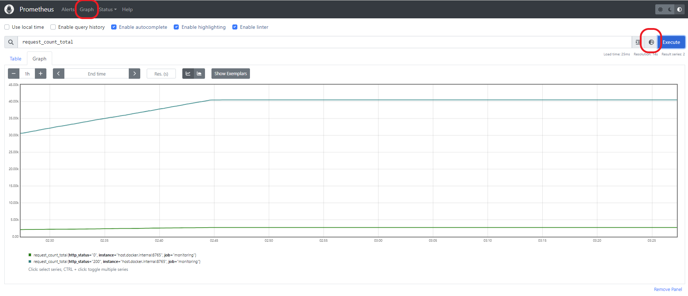
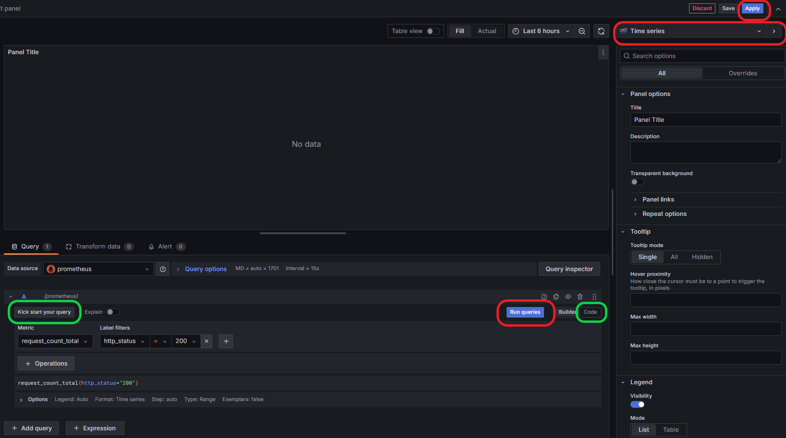
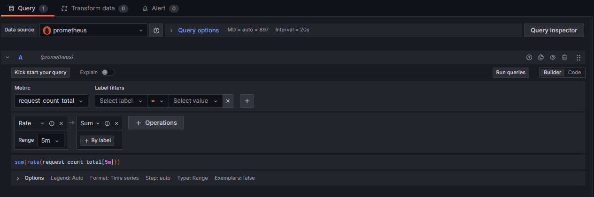

# Lab 7: Monitoring using Prometheus and Grafana
In this lab, you will gain hands-on experience in monitoring using Prometheus and visualizing metrics through Grafana. Prometheus is an open-source monitoring system for collecting and processing time-series data, while Grafana is a visualization platform for creating interactive dashboards. 

You will set up a Prometheus monitoring system, connect it to a Kafka broker, and track key metrics. This practical application will be valuable for your Milestone 3. There are multiple components in this lab, some of which may be new to you, we strongly advise starting early to familiarize yourself. You can refer the screenshots included in this writeup for additional clarity.

To receive credit for this lab, show your work to the TA during recitation.

## Deliverables
- [ ] Setup Docker with Prometheus and Grafana.	Modify and Run Kafka Monitoring Script.
- [ ] Verify Prometheus targets and metrics. Run queries in prometheus.
- [ ] Configure Grafana Dashboard and add visualizations.

## Getting started
- Ensure Python (preferably 3.8, 3.9, 3.10) and Docker is installed on your machine.
- Clone the starter code from this [Git repository](https://github.com/XueyingJia/mlip-monitoring-lab) 
- Navigate to this Github folder
- Install required dependencies
    - `pip install -r requirements.txt`
- Establish an SSH tunnel to the Kafka broker if not already connected
    - `ssh -o ServerAliveInterval=60 -L 9092:localhost:9092 tunnel@128.2.204.215 -NTf`

## Background
- Familiarize yourself with the `docker-compose.yaml` and `prometheus.yml` files.
- `docker-compose.yaml` file contains information about all the services inside docker along with their ports. 
- `prometheus.yml` file contains all data that prometheus tracks.

## Setup Docker and Run Kafka Monitoring Script
1. Execute `docker compose up -d` in the directory where docker-compose.yaml is located.
2. Check Prometheus Status at http://localhost:9090. Navigate to Status > Targets. Initially, Prometheus will be up, but Kafka-monitoring metrics will be down.
3. Update TODO sections in kafka-monitoring.py to expose relevant metrics to track.
4. Run the Kafka monitoring script: 
    - `python kafka-monitoring.py`

## Prometheus Targets and Queries
1. Verify that all targets are active in Prometheus under Status > Targets.
2. Kafka metrics are visible at http://localhost:8765, reflecting the metrics you coded in kafka-monitoring.py.
3. Node exporter metrics are available at http://localhost:9100. These are system / host level metrics.
4. Use the Prometheus dashboard's Graph section to explore metrics. Click on the metrics explorer (earth icon) and search for `request_count_total` to visualize total requests with their status.
5. Feel free to explore various metrics available in metrics explorer in the table/graph format.

## Configure Grafana Dashboard for Visualization
### Add Data Source in Grafana
1. Access Grafana at http://localhost:3000 and login (default username: admin, password: admin). 
2. Add Prometheus as a data source by navigating to Connections > Data sources > Add source > Prometheus.
3. In the Connection section, set the Prometheus server URL to http://prometheus:9090 (NOT http://localhost:9090).
4. Save and test the data source to confirm connectivity.

### Configure Dashboard
1. Go to Dashboards > create a new dashboard > add visualization.
2. Choose the Prometheus data source you added. Now we will add multiple visualizations (panels) on this dashboard. 
3. You can use `kick start your query` button in Query section at the bottom to explore different query types. You can also click on `code` to write [PromQL](https://grafana.com/blog/2020/02/04/introduction-to-promql-the-prometheus-query-language/) queries.
4. Panel 1: Total successful requests - Count the total number of requests with status code 200. 
   1. Add `request_count_total` as metric, filter label `http_status` and equate to `200`. Make sure that visualization selected is time series. 
   2. You can see the query generated at the bottom. Alternatively, you can write the query using `code` option.
   3. Click on run queries and select Apply. You will see the panel added to dashboard. Click save after every panel.
   
   
5. Panel 2: Total Recommendation Requests Over Time - Total of rate of requests over time (5 min)
   1. Click on add> visualization. In the queries below, add `request_count_total` as metric. 
   2. Add operations> range functions > rate  with range 5m
   3. Add one more operations> aggregations > sum. 
   4. Visualization should be time series. Run query and Apply. 
   

6. Panel 3: Node CPU usage - Track CPU time consumed in 'system' mode by the node
   1. HINT: Track rate of `node_cpu_seconds_total`

7. Panel 4: Average Request Latency - Average latency for all recommendation requests
   1. HINT: Use forms of `request_latency_seconds`. Make use of formula for average= sum/count

## Optional: Customize panels
Customize your panels with titles and labels, and adjust the visualizations for better clarity and insight. 
Experiment with the Grafana interface to make your dashboard more intuitive. Refer this for [dashboard](https://grafana.com/grafana/dashboards/) configurations.

## FAQ:
1. Q: How to establish an SSH tunnel to the Kafka broker? \
   A: Refer to Lab2 canvas assignment page for more information
2. Q: I cannot log in Grafana using default password. \
   A: If this is not the first time you use Grafana, you possibly have changed the password before. You could reset the password in docker by running command: 'grafana-cli admin reset-admin-password newpassword'.
3. Q: I cannot pass 'save and test' while connecting Prometheus server. \
   A: Make sure you are using the correct URL for Prometheus server. It should be http://prometheus:9090, NOT http://localhost:9090.

## Additional resources
- [Prometheus Overview](https://prometheus.io/docs/introduction/overview/)
- [Prometheus Latest Documentation](https://prometheus.io/docs/prometheus/latest/migration/)
- [Node Exporter GitHub Repository](https://github.com/prometheus/node_exporter)
- [Alert Manager Overview](https://prometheus.io/docs/alerting/latest/overview/)
- [Grafana Documentation](https://grafana.com/docs/)
---

Note: If you're not seeing any metric data on Prometheus or Grafana, please check if the kafka topic events are not throwing an error. If the topic has events that do not respond back with 200 status code, change the topic to some other topic `movielogN`
